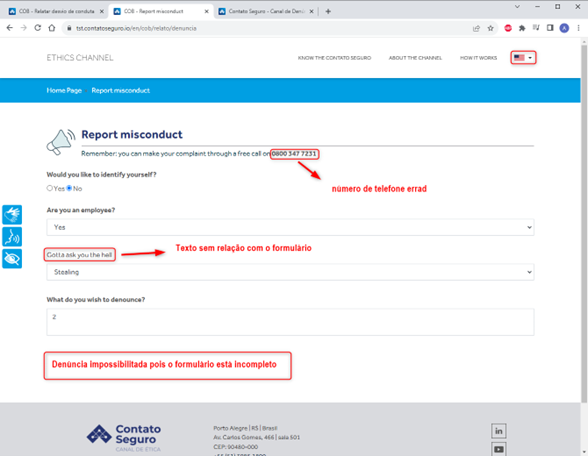

# Plando de Testes - Site Contato Seguro – COB

Este Plano de Teste compreende testes funcionais, de usabilidade e responsividade do site Contato Seguro - COB e abrange as seguintes funções:
*  Faça uma denúncia
*	Faça uma sugestão
*	Tire uma dúvida
*	Acessibilidade do site
*	Navegação do site
*	Função alterar idioma

## Tabela Resumo dos Casos de Teste

## Casos de Teste

**1.	DENÚNCIA**

DADO que o usuário deseja fazer uma denúncia 

QUANDO clicar em ‘Faça a sua Denúncia’ 

E preencher os dados necessários 

ENTÃO DEVE poder enviar sua denúncia com sucesso 

**2.	SUGESTÃO**

DADO que o usuário deseja fazer uma sugestão

QUANDO clicar em ‘Faça a sua Sugestão’

E preencher os dados necessários

ENTÃO DEVE poder enviar sua sugestão com sucesso

**3.	DÚVIDA**

DADO que o usuário deseja tirar uma denúncia

QUANDO clicar em ‘DÚVIDA’

E preencher os dados necessários

ENTÃO DEVE poder enviar sua dúvida com sucesso

**4.	ACESSIBILIDADE**

DADO que o usuário deseja usar uma função de acessibilidade

QUANDO clicar em alguma das opções

ENTÃO DEVE poder navegar com o auxílio necessário

**5.	NAVEGAÇÃO**

DADO que o usuário deseja navegar nos menus do site

QUANDO clicar em algum dos botões disponíveis

ENTÃO DEVE ser direcionado de acordo com o botão correspondente
 

**6.	IDIOMAS**

DADO que o usuário deseja utilizar o site em outro idioma

QUANDO clicar na seleção de idiomas e selecionar um idioma

ENTÃO o site deve ser traduzido para o idioma selecionado

## Cadastro de BUGS

**1. DENÚNCIA**

**Título do BUG:** DENUNCIA | ERRO seleção de unidade

Data: 31/08/2023

Descrição do cenário do Teste: Deve poder preencher o formulário e avançar sem problemas

BUG: Existem 3 seleções de unidade e elas não correspondem ao estado selecionado

Evidências:

Grau de impacto no Sistema/Severidade: Alta

**Título do BUG:** DENUNCIA | Evidências em vídeo não são aceitos

Data: 31/08/2023

Descrição do cenário do Teste: Deve aceitar vídeos para as evidências de denúncia

BUG: não foi aceito o upload de vídeo em formato .mkv

Evidências: 

Grau de impacto no Sistema/Severidade: Baixa

**Título do BUG:** DENUNCIA | Formulário de denúncia em inglês está incompleto

Data: 31/08/2023

Descrição do cenário do Teste: Deve ser possível preencher o formulário em todos os idiomas disponíveis

BUG: Não é possível cadastrar denúncia em inglês

Evidências: 

Grau de impacto no Sistema/Severidade: Alta

**2. SUGESTÃO**

**Título do BUG:** SUGESTÃO | ERRO botão não funciona português

Data: 31/08/2023

Descrição do cenário do Teste: Deve poder fazer sugestão através do respectivo botão

Evidências: 

BUG: botão de sugestão apenas recarrega a página

Grau de impacto no Sistema/Severidade: Crítico
 

**Título do BUG:** SUGESTÃO | ERRO botão não funciona inglês

Data: 31/08/2023

Descrição do cenário do Teste: Deve poder fazer sugestão através do respectivo botão

Evidências: 

BUG: botão de sugestão sem texto e recarrega a página em português

Grau de impacto no Sistema/Severidade: Crítico

**3. DÚVIDA**

**Título do BUG:** DÚVIDA | ERRO botão não disponível

Data: 31/08/2023

Descrição do cenário do Teste: Deve poder tirar dúvida através do respectivo botão

Evidências: 

BUG: botão de dúvida não é exibido

Grau de impacto no Sistema/Severidade: Crítico

**4. ACESSIBILIDADE**

**Título do BUG:** ACESSIBILIDADE | ERRO acessibilidade desabilitada

Data: 31/08/2023

Descrição do cenário do Teste: Deve poder usar as funções de acessibilidade

Evidências: 

BUG: acessibilidade indisponível

Grau de impacto no Sistema/Severidade: Crítico

**5. NAVEGAÇÃO**

**Título do BUG:** NAVEGAÇÃO | Botões do banner trocados

Data: 31/08/2023

Descrição do cenário do Teste: Deve poder navegar através dos botões do banner

Evidências: 

BUG: botões trocados

Grau de impacto no Sistema/Severidade: Baixo

**Título do BUG:** NAVEGAÇÃO | ERRO de responsividade no quadro explicativo

Data: 31/08/2023

Descrição do cenário do Teste: O site deve ter responsividade para celulares e janelas mais estreitas

Evidências: 

BUG: o quadro explicativo é muito grande para ler no celular

Grau de impacto no Sistema/Severidade: Médio

**6. IDIOMAS**

**Título do BUG:** IDIOMAS | ERROS no texto em português

Data: 31/08/2023

Descrição do cenário do Teste: Texto deve estar escrito corretamente

Evidências: 

BUG: erros no texto

Grau de impacto no Sistema/Severidade: Baixo

**Título do BUG:** IDIOMAS | ERROS no texto em inglês

Data: 31/08/2023

Descrição do cenário do Teste: Texto deve estar escrito corretamente

Evidências: 

BUG: texto confuso e afirmando que as denúncias sofrerão retaliações

Grau de impacto no Sistema/Severidade: Médio

**Título do BUG:** IDIOMAS | ERROS no site em inglês

Data: 31/08/2023

Descrição do cenário do Teste: O site deve ser traduzido corretamente

Evidências: 

BUG: alguns textos não são exibidos no site em inglês e o quadro explicativo não foi traduzido

Grau de impacto no Sistema/Severidade: Médio
